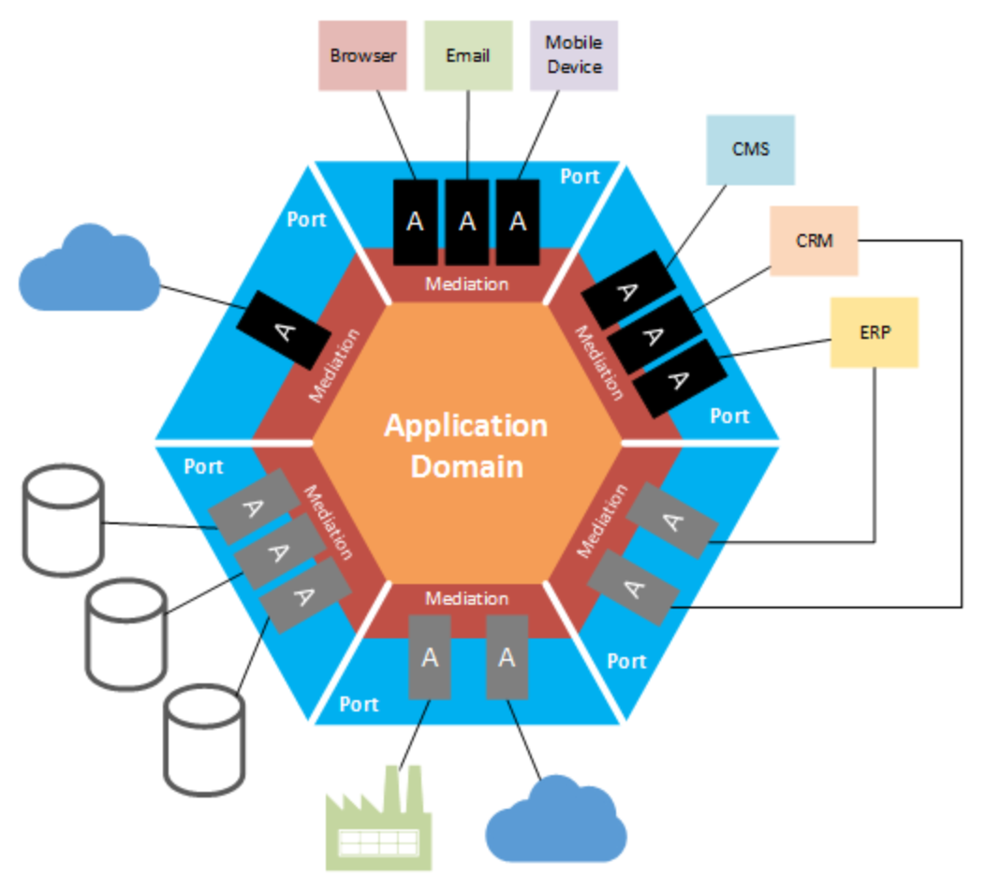
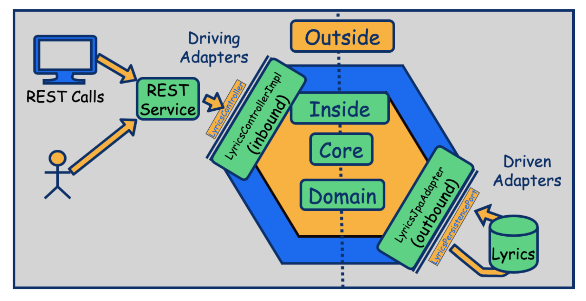

# Hexagonal Architecture 

La Arquitectura Hexagonal, dada a conocer por Alistair Cockburn — y también conocida como arquitectura de puertos y 
adaptadores, tiene como principal motivación separar nuestra aplicación en distintas capas o regiones con su 
propia responsabilidad. De esta manera consigue desacoplar capas de nuestra aplicación permitiendo que evolucionen de 
manera aislada. Además, tener el sistema separado por responsabilidades nos facilitará la reutilización.

## Hexagonal Architecture Django

